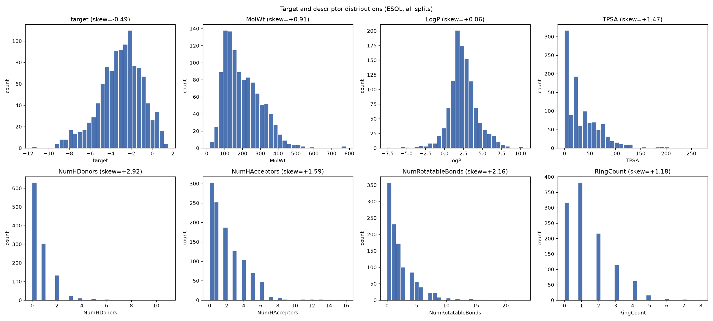

# Distribution analysis: target and descriptors

Answers the two still-open data-quality items: what does the target/descriptor distribution actually look like (shape, skew, range), not just which individual molecules are IQR outliers (already covered in `data/processed/report.md`).

n = 1117 molecules (all splits combined).

## Summary statistics

| Variable | Mean | Median | Std | Skewness | Min | Max |
|---|---|---|---|---|---|---|
| target | -3.05 | -2.86 | 2.10 | -0.49 | -11.60 | 1.58 |
| MolWt | 203.71 | 182.17 | 102.94 | +0.91 | 16.04 | 780.95 |
| LogP | 2.45 | 2.34 | 1.85 | +0.06 | -7.57 | 10.39 |
| TPSA | 34.71 | 26.02 | 35.33 | +1.47 | 0.00 | 268.68 |
| NumHDonors | 0.69 | 0.00 | 1.08 | +2.92 | 0.00 | 11.00 |
| NumHAcceptors | 2.06 | 2.00 | 2.11 | +1.59 | 0.00 | 16.00 |
| NumRotatableBonds | 2.17 | 1.00 | 2.64 | +2.16 | 0.00 | 23.00 |
| RingCount | 1.39 | 1.00 | 1.32 | +1.18 | 0.00 | 8.00 |

## Interpretation

**Target (log solubility, mol/L):** skewness = -0.49. This is a mild-to-moderate left skew (a longer tail toward very insoluble compounds) rather than a severe one - the target is reasonably well-behaved for both a linear model (Ridge) and a tree-based model (XGBoost), so no target transformation looks necessary.

**Notably skewed descriptors (|skew| > 1.0):** `TPSA` (+1.47), `NumHDonors` (+2.92), `NumHAcceptors` (+1.59), `NumRotatableBonds` (+2.16), `RingCount` (+1.18). Long right tails on count-like descriptors (e.g. `NumRotatableBonds`, `RingCount`, `NumHAcceptors`) are typical for small drug-like molecule datasets - most compounds have a handful of rotatable bonds/rings/acceptors, with a few larger, more flexible or more polycyclic outliers pulling the tail. This is more of a concern for a linear model (a few high-leverage points can dominate the fit) than for XGBoost, which only needs a sensible split point and does not assume linearity or homoscedasticity.

**Connection to multicollinearity findings (`ml/results/feature_engineering_report.md`):** that report found these high-correlation (|r| > 0.7) descriptor pairs: TPSA <-> NumHDonors: r=0.755, TPSA <-> NumHAcceptors: r=0.899.
Of the skewed descriptors here, TPSA <-> NumHDonors: r=0.755, TPSA <-> NumHAcceptors: r=0.899 also appear in that multicollinearity list - a skewed variable that is also highly correlated with another feature is a double reason a linear model needs care (e.g. dropping or combining one of the pair, or a monotonic transform), while for the winning XGBoost model neither skew nor this correlation is a correctness issue - at most a mild loss of interpretability if two correlated features split importance between them.
