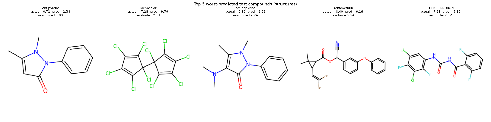

# Whole-test-set error analysis

Test set: 107 compounds. This looks beyond the 17 known IQR-outlier compounds (see `ml/results/evaluation_report.md`) at error patterns across the *whole* test set.

## Top 10 worst-predicted test compounds (by |residual|)

| Compound | Actual | Predicted | Residual | MolWt | LogP | TPSA |
|---|---|---|---|---|---|---|
| Antipyrene | 0.71 | -2.38 | +3.09 | 188.2 | 1.48 | 26.9 |
| Dienochlor | -7.28 | -9.79 | +2.51 | 474.6 | 7.73 | 0.0 |
| aminopyrine | -0.36 | -2.61 | +2.24 | 231.3 | 1.55 | 30.2 |
| Deltamethrin | -8.40 | -6.16 | -2.24 | 505.2 | 6.49 | 59.3 |
| TEFLUBENZURON | -7.28 | -5.16 | -2.12 | 381.1 | 4.51 | 58.2 |
| Coronene | -9.33 | -7.21 | -2.12 | 300.4 | 6.92 | 0.0 |
| Anthraquinone | -5.19 | -3.08 | -2.11 | 208.2 | 2.46 | 34.1 |
| Cyhalothrin | -8.18 | -6.16 | -2.02 | 449.9 | 6.54 | 59.3 |
| Flumethasone | -5.61 | -3.74 | -1.88 | 410.5 | 1.84 | 94.8 |
| Cypermethrin | -8.02 | -6.17 | -1.85 | 416.3 | 6.18 | 59.3 |

Worst-10 MAE: 2.219 vs. rest-of-test MAE: 0.474 vs. whole-test MAE: 0.637

## Correlation of |residual| with each descriptor (whole test set)

| Descriptor | Pearson r with |residual| |
|---|---|
| MolWt | +0.346 |
| LogP | +0.223 |
| TPSA | +0.121 |
| NumHDonors | -0.039 |
| NumHAcceptors | +0.119 |
| NumRotatableBonds | +0.240 |
| RingCount | +0.183 |

## Descriptor means: worst-10 vs. rest of test set

| Descriptor | Worst-10 mean | Rest mean | Difference |
|---|---|---|---|
| MolWt | 356.57 | 248.33 | +108.24 |
| LogP | 4.57 | 2.94 | +1.63 |
| TPSA | 42.22 | 38.86 | +3.36 |
| NumHDonors | 0.50 | 0.77 | -0.27 |
| NumHAcceptors | 2.40 | 2.32 | +0.08 |
| NumRotatableBonds | 2.60 | 1.76 | +0.84 |
| RingCount | 3.10 | 2.33 | +0.77 |

## Pattern summary

Strongest |residual| correlation: **MolWt** (r=+0.346). Largest worst-10-vs-rest mean gap: **MolWt** (+108.24).

There is a moderate-to-strong relationship between MolWt and prediction error on this test set - predictions are less reliable at the high end of this descriptor's range. This is broadly consistent with the applicability-domain limitation already documented for large/hydrophobic outlier compounds in `ml/results/evaluation_report.md` and `models/production/metadata.json`.
