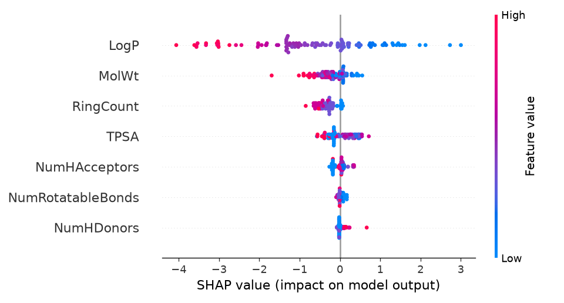
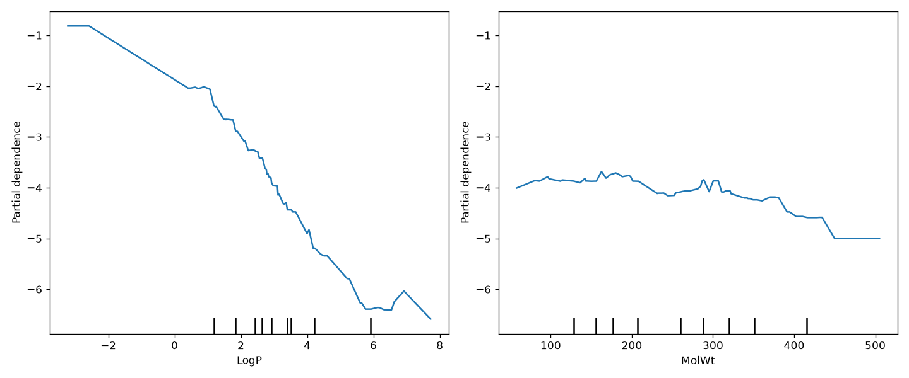

# Interpretability report (SHAP, winner: xgboost_tuned)

## Global feature importance (mean |SHAP value| on test set)

- LogP: 1.272
- MolWt: 0.328
- RingCount: 0.326
- TPSA: 0.274
- NumHAcceptors: 0.108
- NumRotatableBonds: 0.051
- NumHDonors: 0.049

## SHAP vs native XGBoost feature importance

Native importance is XGBoost's built-in `.feature_importances_` (gain-based: average improvement in the loss function attributable to each feature across all splits that use it), computed on the same fitted model, no test data needed. Ranks are 1 = most important for each method.

| Feature | SHAP mean\|value\| | SHAP rank | XGBoost gain importance | Native rank |
|---|---|---|---|---|
| MolWt | 0.328 | 2 | 0.124 | 2 |
| LogP | 1.272 | 1 | 0.577 | 1 |
| TPSA | 0.274 | 4 | 0.062 | 5 |
| NumHDonors | 0.049 | 7 | 0.032 | 7 |
| NumHAcceptors | 0.108 | 5 | 0.108 | 3 |
| NumRotatableBonds | 0.051 | 6 | 0.032 | 6 |
| RingCount | 0.326 | 3 | 0.064 | 4 |

**Agreement:** both methods rank `LogP` as the single most important feature.

## Partial dependence plots (top 2 features: LogP, MolWt)

Partial dependence shows the marginal effect of each feature on the predicted log solubility, averaging out the other features, using the same fitted `xgboost_tuned` model evaluated on the test set.

## Per-molecule explanations

### Aspirin (`CC(=O)Oc1ccccc1C(=O)O`)
Predicted: -1.68 log(mol/L)

- LogP (1.31): +1.140 (pushes higher)
- TPSA (63.60): +0.265 (pushes higher)
- RingCount (1.00): -0.134 (pushes lower)
- MolWt (180.16): -0.104 (pushes lower)
- NumRotatableBonds (2.00): -0.048 (pushes lower)
- NumHAcceptors (3.00): +0.043 (pushes higher)
- NumHDonors (1.00): -0.017 (pushes lower)

### Caffeine (`Cn1cnc2c1c(=O)n(C)c(=O)n2C`)
Predicted: -2.40 log(mol/L)

- LogP (-1.03): +1.416 (pushes higher)
- RingCount (2.00): -0.575 (pushes lower)
- MolWt (194.19): -0.339 (pushes lower)
- NumHDonors (0.00): -0.042 (pushes lower)
- NumRotatableBonds (0.00): -0.015 (pushes lower)
- TPSA (61.82): -0.008 (pushes lower)
- NumHAcceptors (3.00): -0.003 (pushes lower)

