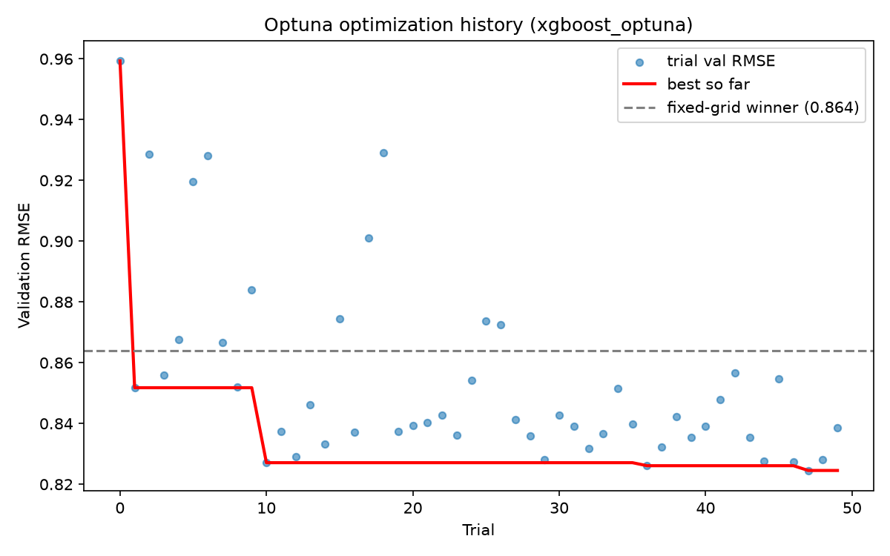

# Optuna hyperparameter search report

Data version: `815a49ba02ea` (sha256[:12] of `data/processed/esol_processed.csv`)

## Search space

| Hyperparameter | Range | Sampling |
|---|---|---|
| max_depth | 2-8 | int, uniform |
| learning_rate | 0.01-0.3 | float, log-uniform |
| n_estimators | 100-800 | int, uniform |
| subsample | 0.5-1.0 | float, uniform |
| colsample_bytree | 0.5-1.0 | float, uniform |

Sampler: `TPESampler(seed=42)`. Trials: 50. Selection: best val RMSE (test never touched during search).

## Best configuration found

```
{
  "max_depth": 2,
  "learning_rate": 0.03393891168826373,
  "n_estimators": 697,
  "subsample": 0.676174595034123,
  "colsample_bytree": 0.9089797234514216
}
```

## Results

| Model | Split | RMSE | MAE | R2 |
|---|---|---|---|---|
| xgboost_optuna | val | 0.825 | 0.678 | 0.836 |
| xgboost_optuna | test | 0.820 | 0.611 | 0.838 |

## Comparison to the existing fixed-grid winner (`xgboost_tuned`)

- Fixed-grid winner val RMSE: 0.864
- Optuna best val RMSE: 0.825
- Difference: +0.039 RMSE (improvement)

**Honest verdict:** a meaningful improvement. Optuna found a configuration that beats the fixed-grid winner by a margin larger than typical noise on this dataset size. This metrics file is available for a human to consider promoting via `select_winner.py`.


